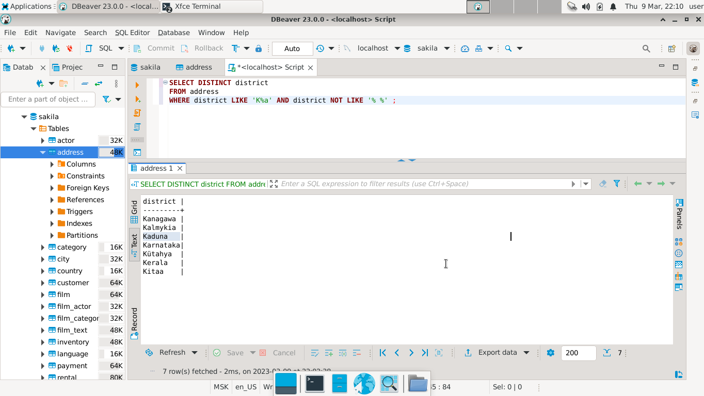
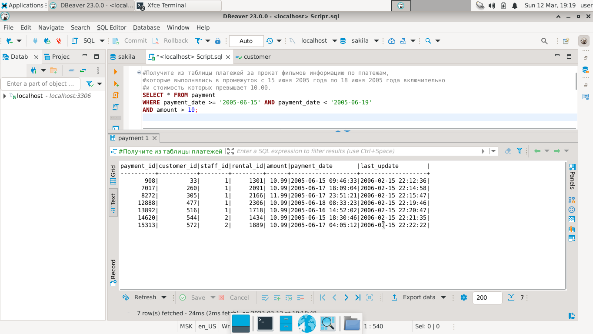
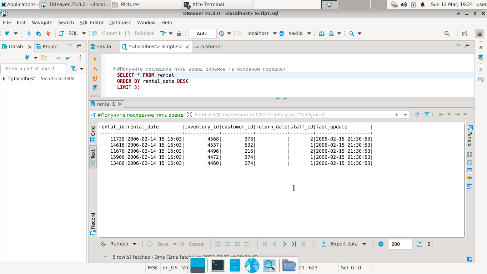
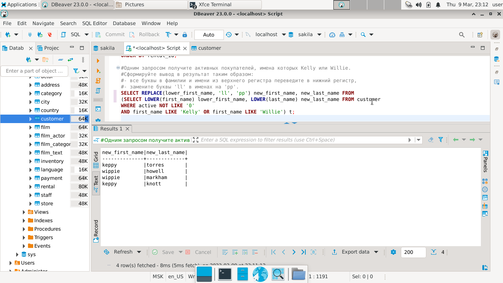
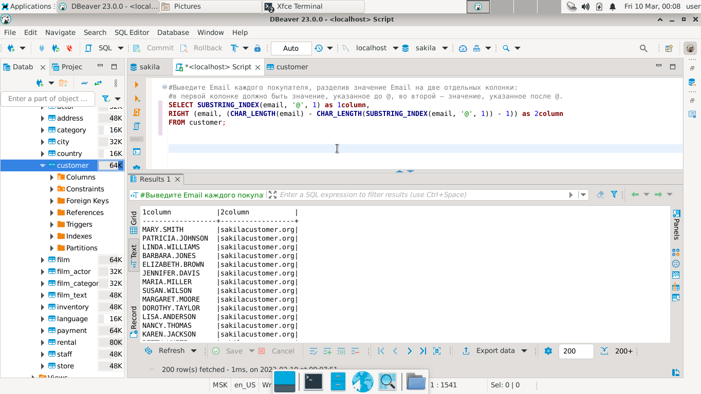
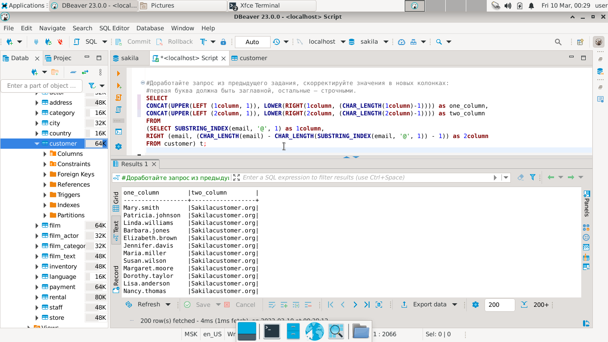

# Домашнее задание к занятию 12.3. «SQL. Часть 1» - `Елена Махота`

[См. Script.sql](Script.sql)

- [Ответ к Заданию 1](#1)
- [Ответ к Заданию 2 - доработано](#2)
- [Ответ к Заданию 3 - доработано](#3)
- [Ответ к Заданию 4](#4)
- [Ответ к Заданию 5*](#5)
- [Ответ к Заданию 6*](#6)


---

Задание можно выполнить как в любом IDE, так и в командной строке.

### Задание 1

Получите уникальные названия районов из таблицы с адресами, которые начинаются на “K” и заканчиваются на “a” и не содержат пробелов.

### *<a name = "1"> Ответ к Заданию 1</a>*

```sql
SELECT DISTINCT district 
FROM address 
WHERE district LIKE 'K%a' AND district NOT LIKE '% %' ;
```



---

### Задание 2 

Получите из таблицы платежей за прокат фильмов информацию по платежам, которые выполнялись в промежуток с 15 июня 2005 года по 18 июня 2005 года **включительно** и стоимость которых превышает 10.00.

### *<a name = "2"> Ответ к Заданию 2 - доработано</a>*

```sql
SELECT * FROM payment 
WHERE payment_date >= '2005-06-15' AND payment_date < '2005-06-19'
AND amount > 10;
```



---

### Задание 3

Получите последние пять аренд фильмов.


### *<a name = "3"> Ответ к Заданию 3 - доработано</a>*

```sql
SELECT * FROM rental
ORDER BY rental_date DESC
LIMIT 5;
```



---

### Задание 4

Одним запросом получите активных покупателей, имена которых Kelly или Willie. 

Сформируйте вывод в результат таким образом:
- все буквы в фамилии и имени из верхнего регистра переведите в нижний регистр,
- замените буквы 'll' в именах на 'pp'.


### *<a name = "4"> Ответ к Заданию 41</a>*

```sql
SELECT REPLACE(lower_first_name, 'll', 'pp') new_first_name, new_last_name FROM
(SELECT LOWER(first_name) lower_first_name, LOWER(last_name) new_last_name FROM customer 
WHERE active NOT LIKE '0' 
AND first_name LIKE 'Kelly' OR first_name LIKE 'Willie') t;
```



---

## Дополнительные задания (со звёздочкой*)
Эти задания дополнительные, то есть не обязательные к выполнению, и никак не повлияют на получение вами зачёта по этому домашнему заданию. Вы можете их выполнить, если хотите глубже шире разобраться в материале.

### Задание 5*

Выведите Email каждого покупателя, разделив значение Email на две отдельных колонки: в первой колонке должно быть значение, указанное до @, во второй — значение, указанное после @.


### *<a name = "5"> Ответ к Заданию 5*</a>*
```sql
SELECT SUBSTRING_INDEX(email, '@', 1) as 1column, 
RIGHT (email, (CHAR_LENGTH(email) - CHAR_LENGTH(SUBSTRING_INDEX(email, '@', 1)) - 1)) as 2column
FROM customer;
```

---

### Задание 6*

Доработайте запрос из предыдущего задания, скорректируйте значения в новых колонках: первая буква должна быть заглавной, остальные — строчными.

### *<a name = "6"> Ответ к Заданию 6*</a>*

```sql
SELECT 
CONCAT(UPPER(LEFT (1column, 1)), LOWER(RIGHT(1column, (CHAR_LENGTH(1column)-1)))) as one_column, 
CONCAT(UPPER(LEFT (2column, 1)), LOWER(RIGHT(2column, (CHAR_LENGTH(2column)-1)))) as two_column
FROM
(SELECT SUBSTRING_INDEX(email, '@', 1) as 1column, 
RIGHT (email, (CHAR_LENGTH(email) - CHAR_LENGTH(SUBSTRING_INDEX(email, '@', 1)) - 1)) as 2column 
FROM customer) t;
```


